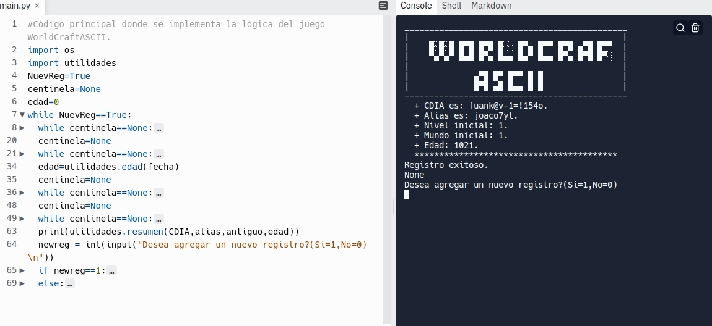
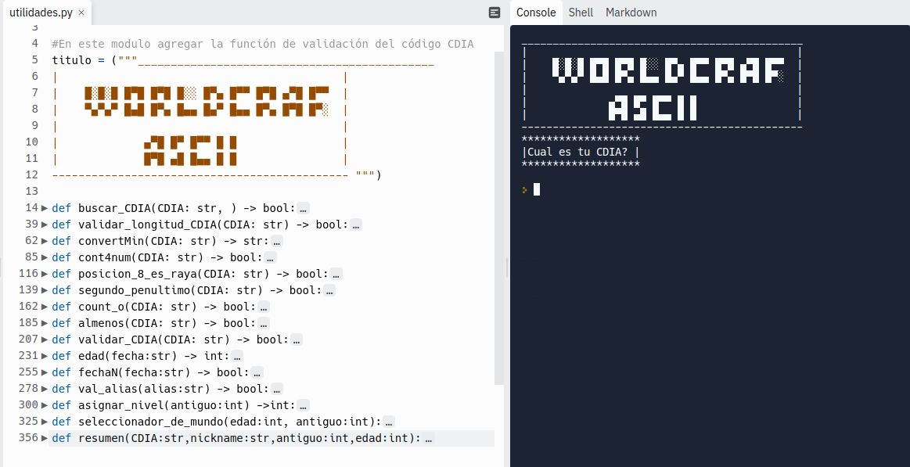

### ____________________________
#   WORLDCRAFT ASCII  
  ##############################

# IDENTIFICAR

Este reto se trata de implementar un programa que permita verificar los datos de un aspirante a jugador del juego y asignarle un nivel de inicio.

# DEFINIR

Esta función tiene como objetivo realizar una verificación para evaluar la posibilidad de que una persona pueda ingresar como nuevo jugador del WorldCraft ASCII, para ello se solicita el CDIA (código de identificación ASCII) del aspirante. Este CDIA es una cadena de 15 caracteres que debe cumplir con las siguientes restricciones y las cuales deben ser validadas por el programa una vez se ingresa:
+ Convertir el CDIA a minúsculas
+ El CDIA debe tener 4 dígitos numéricos
+ En la posición 8 de la cadena del CDIA debe ir siempre el carácter menos (‘-’)
+ El carácter en la segunda posición y el carácter de la penúltima posición del CDIA
deben ser diferentes.
+ El código CDIA no debe contener más de 1 vez la letra ’o’
+ El CDIA debe tener al menos uno de los siguientes símbolos (‘>’,’=’, ‘@’)

**Si el CDIA no cumple con alguna de estas reglas se debe presentar el mensaje “CDIA inválido”**

Una vez se ha validado el código CDIA se le deben hacer las siguientes preguntas:
+ Fecha de Nacimiento (en formato AAAA-MM-DD)
  + (la edad del jugador debe ser mayor a 15 años y debes calcularla)
+ Si la edad es correcta debes preguntar los siguientes datos
  + Alias del jugador (Una cadena de caracteres de una longitud máxima de 8 y
debe contener al menos un número)
  + Preguntar ¿Ya has jugado WorldCraft ASCII? (Si = 1, No = 0)
  + Si ya ha jugado asignar el nivel 10
  + Si no ha jugado asignar el nivel 1.
+ Si la edad del jugador es igual o inferior a 15 debe mostrar un mensaje que no puede jugar

Segundo sub-reto: Asignar mundo
Cuando un nuevo jugador es admitido al WorldCraft ASCII se le debe asignar un Mundo
para iniciar a jugar de acuerdo con las siguientes reglas:
+ Mundo 1: jugadores entre 16 y 30 años que no han jugado antes.
+ Mundo 2: jugadores entre 16 y 30 años que ya han jugado antes.
+ Mundo 3: jugadores entre 31 y 40 años que ya han jugado antes
+ Mundo 4: jugadores mayores a 40 años que no han jugado antes
El programa debe tener una función que reciba la edad (ya calculada) del nuevo jugador,
la respuesta si ha jugado antes, con estos datos debe retornar el mundo que le
corresponde al jugador.

# ALGORITMOS

Esta función tiene como objetivo realizar una verificación para evaluar la posibilidad de que una persona pueda ingresar como nuevo jugador del WorldCraft ASCII, para ello se solicita el CDIA (código de identificación ASCII) del aspirante. 

**Este CDIA es una cadena de 15 caracteres que debe cumplir con las siguientes restricciones y las cuales deben ser
validadas por el programa una vez se ingresa**

## Validaciones
#### Convertir el CDIA a minúsculas
  
~~~ 
def convertMin(CDIA: str) -> str: 
  """ 
	Función encarga de convertir un código de CDIA a minusculas

	Parameters
	-----------------
	CDIA : str
		Código de identificación ASCII

	Returns
	------------------
	CDIA : str
		Código de identificación ASCII en minuscula
	"""
	#------------------------------------------------
	# Convertir a minuscula. 
	#------------------------------------------------
	# Devuelve True des pues de convertir el CDIA en minuscula
  min = ""
  for i in range(0,len(CDIA)):
    min += CDIA[i].lower()
  return min 
~~~
#### El CDIA debe tener 4 dígitos numéricos
~~~
def cont4num(CDIA: str) -> bool:
  """ 
	Función encarga de validar si un código de CDIA contiene 4 digitos numericos.

	Parameters
	-----------------
	CDIA : str
		Código de identificación ASCII

	Returns
	------------------
	existe : bool
		Retorna True si cumple, de lo contrario False
	"""
  #------------------------------------------------
	#  Contar numeros
	#------------------------------------------------
	# Un contador inicia en cero y se incrementa cada ves que una letra de CDIA es numerica. Luego si el contador es cuatro devuelve True sino False 

  contador = 0
  for i in range(0,len(CDIA)-1):
    if CDIA[i].isnumeric():
      contador = contador+1
  #------------------------------------------------
	# Contiene 4 numeros?
	#------------------------------------------------
	# Si contador contiene 4 numeros devuelve True sino False 
  if contador == 4:
    return True
  else:
    return False
~~~
#### En la posición 8 de la cadena del CDIA debe ir siempre el carácter menos (‘-’)
~~~
def posicion_8_es_raya(CDIA: str) -> bool:
  """ 
	Función encarga de validar si un código de CDIA contiene - en la posicion 8.

	Parameters
	-----------------
	CDIA : str
		Código de identificación ASCII

	Returns
	------------------
	existe : bool
		Retorna True si cumple, de lo contrario False
	"""
  #------------------------------------------------
	#  Validar 8va posicion 
	#------------------------------------------------
	#  Si CDIA en la 8 posicion es "-"
  if CDIA[7] == "-":
    return True
  else:
    return False 

~~~
#### El carácter en la segunda posición y el carácter de la penúltima posición del CDIA deben ser diferentes.
~~~
def segundo_penultimo(CDIA: str) -> bool:
  """ 
	Función encarga de validar si un código de CDIA contiene la segunda pocicion y la penultima son diferentes

	Parameters
	-----------------
	CDIA : str
		Código de identificación ASCII

	Returns
	------------------
	existe : bool
		Retorna True si cumple, de lo contrario False
	"""
  #------------------------------------------------
	#  Compara el segundo y el penultimo son diferentes   
	#------------------------------------------------
	# Si el segundo elemento de CDIA es diferentes al penultimo devuelva TRUE de lo contrario False
~~~
#### El código CDIA no debe contener más de 1 vez la letra ’o’
~~~
def count_o(CDIA: str) -> bool:
  """ 
	Función encarga de validar si un código de CDIA no contiene "o" mas de una vez.
	Parameters
	-----------------
	CDIA : str
		Código de identificación ASCII

	Returns
	------------------
	existe : bool
		Retorna True si cumple, de lo contrario False
	"""
  #------------------------------------------------
	#  Compara el segundo y el penultimo son iguales   
	#------------------------------------------------
	# 
  plat=convertMin(CDIA)
  if plat.count("o")<=1:
    return True
  else:
    return False 
~~~
#### El CDIA debe tener al menos uno de los siguientes símbolos (‘>’,’=’, ‘@’)
~~~
def almenos(CDIA: str) -> bool:
  """ 
	Función encarga de validar si un código de CDIA contiene "=" o ">" o "@".
	Parameters
	-----------------
	CDIA : str
		Código de identificación ASCII

	Returns
	------------------
	existe : bool
		Retorna True si cumple, de lo contrario False
	"""
  #------------------------------------------------
	#  Contiene "=" o ">" o "@"
	#------------------------------------------------
	# Revisar si contiene "=" o ">" o "@".
  if CDIA.find("=") or CDIA.find("?") or CDIA.find("&"):
    return True
  else:
    return False 
~~~
#### Si el CDIA no cumple con alguna de estas reglas se debe presentar el mensaje “CDIA inválido”
~~~
  while centinela==None:
    print(utilidades.titulo)
    print("""*******************
|Cual es tu CDIA? | 
*******************\n""")
    CDIA = input()
    os.system ("clear") 
    if utilidades.validar_CDIA(CDIA):
      utilidades.validar_CDIA(CDIA)
      centinela=True
    else:
      print("Ingrese un valor Valido")
~~~

**Una vez se ha validado el código CDIA se le deben hacer las siguientes preguntas**

##### Fecha de Nacimiento (en formato AAAA-MM-DD) o (la edad del jugador debe ser mayor a 15 años y debes calcularla)
~~~
def edad(fecha:str) -> int:
  """ 
	Función encarga de calcular la edad del usuario.

	Parameters
	-----------------
	fecha: str
		La fecha ingresada por el usuario como String.

	Returns
	------------------
	edad: int
		Retorna la edad en años del usuario
	"""
	#------------------------------------------------
	#  edad
	#------------------------------------------------
	# 1. En fecha1 transforma fecha de str a time.
  # 2. Calcula edad restando el año actual con el digitado por el usuario.
  # 3. Retorna edad.
  fecha1 = datetime.strptime(fecha, '%d/%m/%Y')
  edad=int(datetime.today().strftime("%Y"))-int(fecha1.strftime("%Y")) 
  return edad
~~~
**Si la edad es correcta debes preguntar los siguientes datos**

#### Alias del jugador (Una cadena de caracteres de una longitud máxima de 8 y debe contener al menos un número) 
~~~
def val_alias(alias:str) -> bool:
  """ 
	Función encarga de validar si el usuario tiene un alias que cumple con ser maximo de 8 caracteres y tener 1 numero

	Parameters
	-----------------
	alias:str
		El alias ingresada por el usuario como String.

	Returns
	------------------
	alias_valido : bool
		Retorna True si cumple, de lo contrario False
	"""
	#------------------------------------------------
	#  Es alias cumple?
	#------------------------------------------------
	# compara si la logitud de alias en menor o igual a 8 y si es alfanumerico, esdecir que contenga almenos un numero y letras
  if len(alias) <= 8 and re.search(r'\d', alias):
    return True
  else:
    return False
~~~
#### Preguntar ¿Ya has jugado WorldCraft ASCII? (Si = 1, No = 0)
~~~
print("""***************************************************
|Ya has jugado WorldCraftASCII antes? (Si=1,No=0)| 
***************************************************\n""")
    antiguo = input()
    os.system ("clear") 
    if antiguo=="1" or antiguo=="0":
      utilidades.asignar_nivel(int(antiguo))
      centinela=True
    else:
      print("Ingrese un valor valida")
  
  print(utilidades.resumen(CDIA,alias,antiguo,edad))
  newreg = int(input("Desea agregar un nuevo registro?(Si=1,No=0) \n"))
~~~
#### Si ya ha jugado asignar el nivel 10 Si no ha jugado asignar el nivel 1.
~~~
def asignar_nivel(antiguo:int) ->int:
  """ 
	Función encarga de asignar el nivel de dificultad con el que iniciara el jugador

	Parameters
	-----------------
	antiguo:int
		Variable que determina si el jugador es antiguo.

	Returns
	------------------
	nivel: int
		Retorna el nivel segun; si es antiguo al nivel 10, sino al nivel 1. 
	"""
	#------------------------------------------------
	#Su nivel es:
	#------------------------------------------------
	# Compara si el jugador es antiguo y le asigna el nivel 10 de lo contrario asigna el nivel 1
  if antiguo == 1:
    nivel=10
    return nivel
  else:
    nivel=1
    return nivel   
~~~
**Si la edad del jugador es igual o inferior a 15 debe mostrar un mensaje que nopuede jugar.**
~~~
def fechaN(fecha:str) -> bool:
  """ 
	Función encarga de validar si el usuario tiene por lo menos de 15 años

	Parameters
	-----------------
	fecha: str
		La fecha ingresada por el usuario como String.

	Returns
	------------------
	edad: bool
		Retorna True si cumple, de lo contrario False
	"""
	#------------------------------------------------
	#  Es mayor de 15?
	#------------------------------------------------
	# compara si la funcion edad devuelve un numero mayor a 15 y retorna True si cumple sino False
  if edad(fecha)>=15:
    return True
  else:
    return False
~~~

**Cuando un nuevo jugador es admitido al WorldCraft ASCII se le debe asignar un Mundo para iniciar a jugar de acuerdo con las siguientes reglas:**

##### Mundo 1: jugadores entre 16 y 30 años que no han jugado antes.
##### Mundo 2: jugadores entre 16 y 30 años que ya han jugado antes.
##### Mundo 3: jugadores entre 31 y 40 años que ya han jugado antes
##### Mundo 4: jugadores mayores a 40 años que no han jugado antes
**El programa debe tener una función que reciba la edad (ya calculada) del nuevo jugador, la respuesta si ha jugado antes, con estos datos debe retornar el mundo que le corresponde al jugador.**
~~~
def seleccionador_de_mundo(edad:int, antiguo:int):
  """ 
	Función encarga de asignar el mundo donde iniciara el jugador

	Parameters
	-----------------
	edad,antiguo:int
		La edad del jugador y si es antiguo.

	Returns
	------------------
	mundo : int
		Retorna mundo
	"""
	#------------------------------------------------
	#Su mundo es:
	#------------------------------------------------
	# Compara si la edad del jugador esta en cierto rango y mira si es antiguo, segun estos parametros asigna el mundo.
  if edad in range(16,30) and antiguo == 0:
    mundo = 1
  if edad in range(16,30) and antiguo == 1:
    mundo = 2
  if edad in range(31,40) and antiguo == 1:
    mundo = 3
  if (edad > 40) and (antiguo == 1):
    mundo = 4
  else:
    mundo = 1
  return mundo
~~~
# Logros

